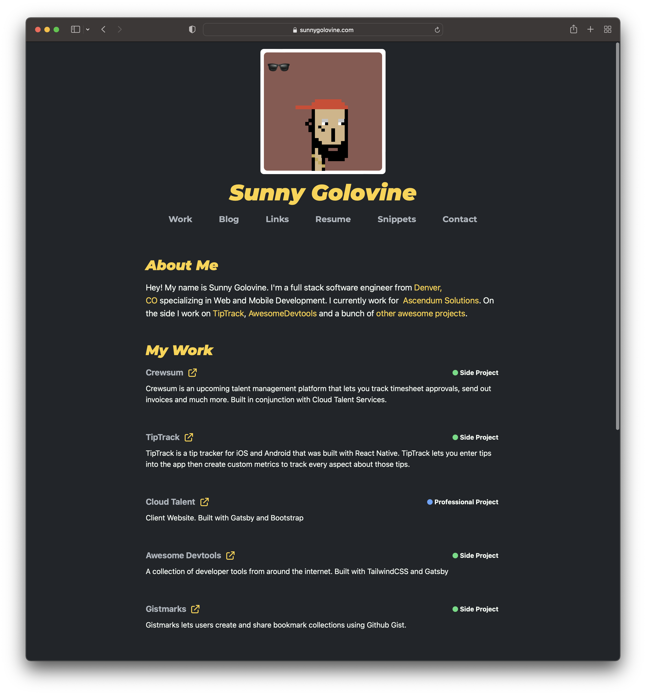

<!-- [ Header ] -->
<div style="width:100%;display:flex;flex-direction:row;justify-content:center;">
  <div style="height:600px;">
    
  </div>
</div>

# sunnygolovine.com

[](https://github.com/sgolovine/sunnygolovine.com/actions/workflows/production-tests-ci.yml) [](https://app.netlify.com/sites/sunnygolovine/deploys) [](https://github.com/sgolovine/sunnygolovine.com/actions/workflows/production-build-ci.yml)

Repository for my personal website.

[Live Version](https://sunnygolovine.com)

## Getting Started

Follow these steps to get the project up and running on your machine.

1. Make sure that you have NodeJS installed. It is recommended to use [NVM](https://github.com/nvm-sh/nvm). You should install v16+

2. Clone this repository:

```bash

git clone https://github.com/sgolovine/sunnygolovine.com

```

3. Install Pre-requisites: You should have [Yarn](https://yarnpkg.com/) installed, the package manager used in this project.

```bash

npm install -g yarn

```

4. Install Dependencies: This should be run inside the project directory.

```bash

yarn install

```

5. Run the Project

```bash

yarn dev

```

## Maintenance

This section covers the ways this project is kept clean. This project uses the following devtools:

- [Typescript](https://www.typescriptlang.org/): Used for typechecking
- [ESLint](https://eslint.org/): Used for linting
- [Prettier](https://prettier.io/): Used for code formatting
- [ts-prune](https://github.com/nadeesha/ts-prune): Used in conjunction with Typescript to find dead code.
- [depcheck](https://github.com/depcheck/depcheck): Checks for unused dependencies.

Below is a table of all maintenance commands. All commands should be run like:

```bash

yarn <<command_name>>

```

| Command                | Description             | Tool       | Config             | Part of `ci` Command |
| ---------------------- | ----------------------- | ---------- | ------------------ | -------------------- |
| `ci`                   | Runs all commands       | All        | ---                | ---                  |
| `typecheck` / `tsc`    | Run typechecking        | Typescript | `tsconfig.json`    | yes                  |
| `lint`                 | Run lining              | ESLint     | `.eslintrc.js`     | yes                  |
| `format`               | Format code             | Prettier   | `.prettierrc`      | yes                  |
| `clean`                | Clean project           | Script     | ---                | no                   |
| `find-unused-code`     | Find unused (dead) code | ts-prune   | `.ts-prunerc.json` | yes                  |
| `find-unused-packages` | Find unused packages    | depcheck   | `.depcheckrc.yml`  | yes                  |
| `cms:lint`             | Lint CMS config         | yamllint   | ---                | no                   |

## Architecture

This section goes over the architecture of teh website. The website is built with [Gatsby](https://www.gatsbyjs.com/) and is hosted on [Netlify](https://www.netlify.com/).

### Data

- **Website Data**: Data for the website is inputted via [NetlifyCMS](https://www.netlifycms.org/). This data is stored in `static/cms/site-data`. It is read by Gatsby using [gatsby-source-filesystem](https://www.gatsbyjs.com/plugins/gatsby-source-filesystem/) and [gatsby-transformer-json](https://www.gatsbyjs.com/plugins/gatsby-transformer-json/).
- **Blog Data**: Blog posts are located in `static/posts`. Blog posts use [MDX](https://mdxjs.com/) to render the posts.
- **Snippets Data**: Snippets are the same as blog posts under the hood. They are also rendered using [MDX](https://mdxjs.com/)
- **Resume Data**: Resume data is stored in `static/resume/resume.json` and uses a heavily modified version of [JSON Resume](https://jsonresume.org/)
- **dev.to posts** - The blog also fetches posts from dev.to. These are fetched using `scripts/fetch-remote-blog-posts.js` script. The data is stored in `static/posts/remotePosts.js`

### Folder Structure

The folder structure uses a modified version of [bulletproof react](https://github.com/alan2207/bulletproof-react). All pages are stored in `src/features` and are only referenced in `src/pages`. This allows for a more flexible model over the standard Gatsby model.

### UI

The UI for the site is built using [TailwindCSS](https://tailwindcss.com/). We also use several utilities like [classnames](https://www.npmjs.com/package/classnames) for custom CSS logic intertwined with JS.

### Dry Building

Part of the "Production CI" is doing a "dry build" to make sure that no code changes caused errors in the Gatsby build process. Dry building is just like regular builds except, we do not fetch actual data for the website and instead use a script to inject test data to speed up the process. The script for generating these files can be located at: `scripts/generate-dry-build-files.js`
